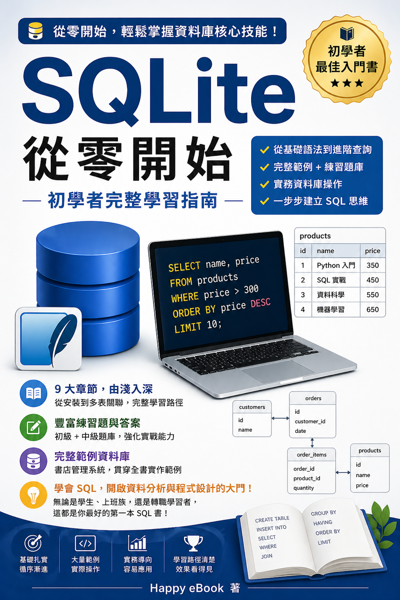

# 2026 現代 SQL 全書
## 從零開始的 SQLite 學習指南

### 🚀 為什麼要學習 SQL？

在數據驅動的時代，SQL 是處理資料的最基本、也最重要的技能。無論您是資料分析師、軟體工程師，還是行銷企劃人員，掌握 SQL 都能讓您直接與資料對話，從龐雜的數據中挖掘價值。

### 📘 本書特色

- **零基礎友善**：從環境安裝到基礎查詢，循序漸進，不用擔心聽不懂專業術語。
- **實戰導向**：使用「書店管理系統」作為貫穿全書的範例，將理論應用於實際場景。
- **SQLite 平台**：免去繁瑣的伺服器設定，下載即用，是學習 SQL 的最佳起點。
- **精選練習**：每章末尾附有練習題與解答，確保您真正掌握所學。

### 📂 您將學到什麼？

本書試閱版包含前五章核心內容：
1. **資料庫簡介**：認識關聯式資料庫與 SQLite。
2. **基本查詢 SELECT**：如何從表格中讀取資料。
3. **條件篩選 WHERE**：精確過濾您需要的資訊。
4. **排序與限制**：讓查詢結果更有條理。
5. **聚合函數與分組**：進行數據統計與分析。

---

    <button onclick="document.querySelector('#chapter-list li:nth-child(2) a').click()" class="buy-button" style="padding: 1.2rem 3rem; font-size: 1.2rem; cursor: pointer;">開始免費試閱 →</button>

---
**Happy eBook 出版** | &copy; 2026 SQL2026
